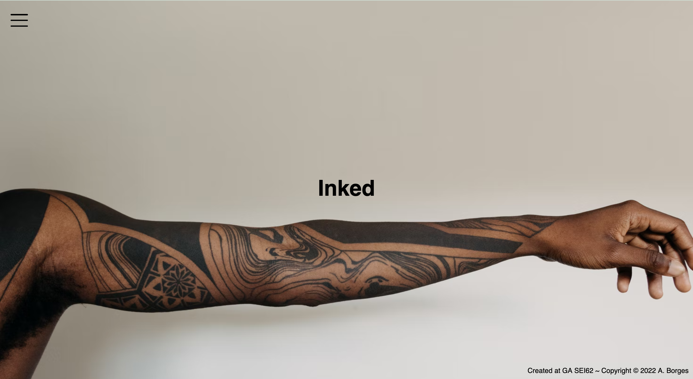
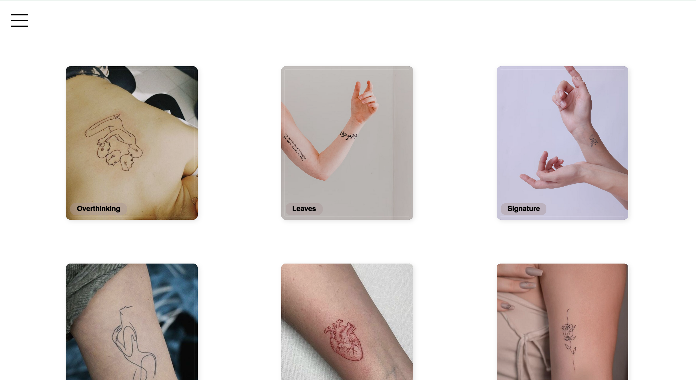
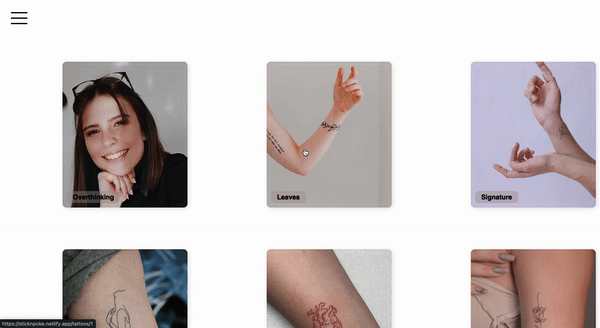
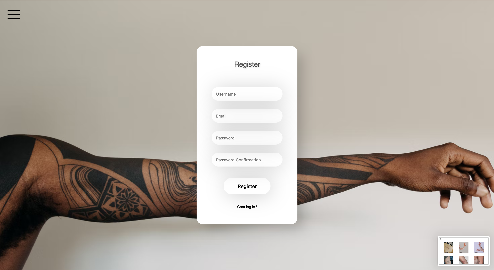
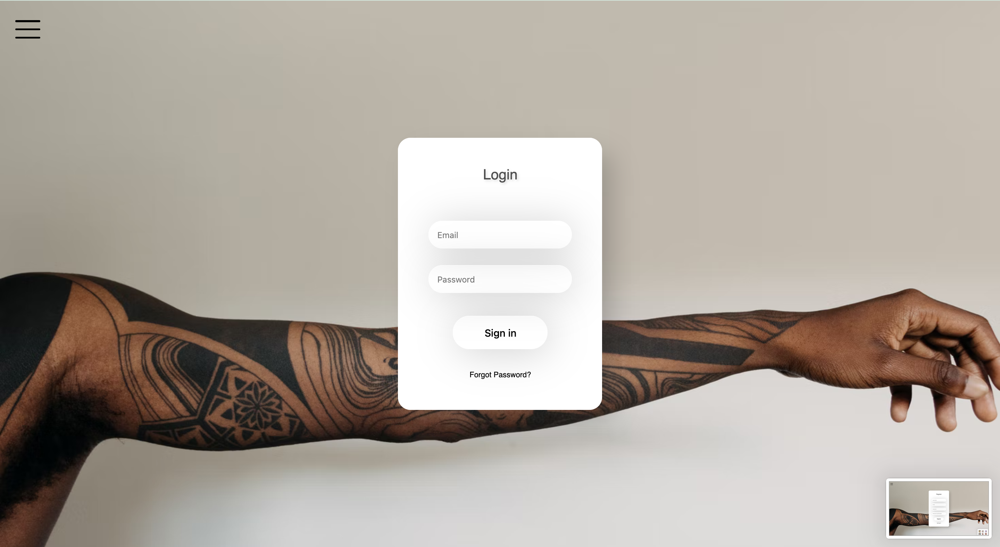
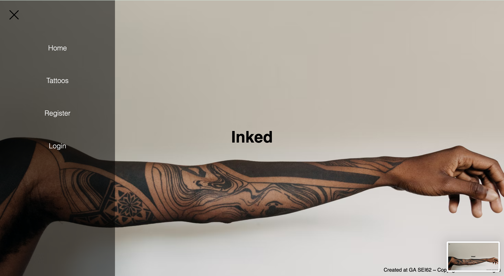
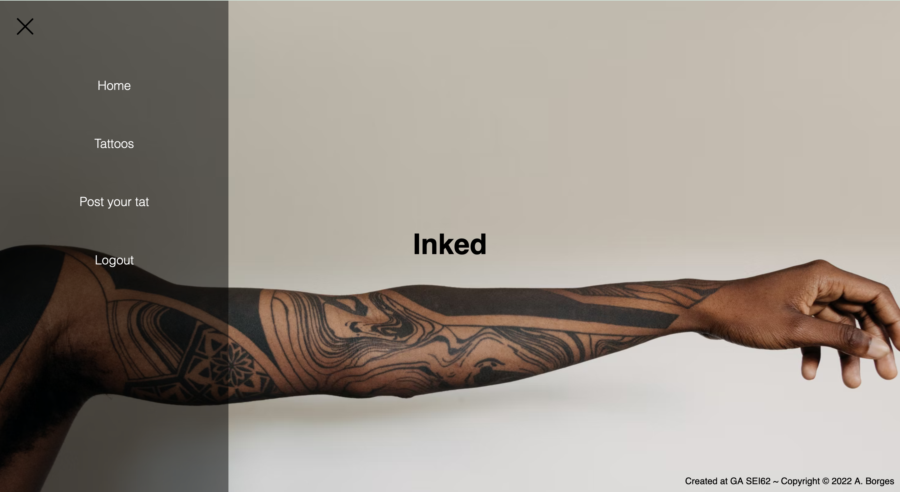

# GA Project Four - Inked

<div align="center">

</div >

## Technologies Used

- Frontend

  - JavaScript
  - HTML
  - CSS
  - React
  - Axios
  - Sass

- Backend

  - Python
  - Django
  - Django REST Framework
  - PostgreSQL
  - PyJWT

- DevOps / Tooling

  - Git, GitHub (Source control)
  - Netlify (Frontend deployment)
  - Heroku (Backend deployment)
  - VS Code
  - Git
  - Postman
  - TablePlus

## To Run Locally

- The project has 2 repositories.
  - [Get the front end](https://github.com/Mafalda-hub/project4-frontend)
  - [Get the back end](https://github.com/Mafalda-hub/project4-backend)

<em>Make sure you have Python3 installed locally</em>

You can find instructions for installing Python3 [here](https://docs.python-guide.org/starting/install3/osx/)

- Starting the backend application

  - [Make sure you have Postgres installed locally](https://www.postgresql.org/download/macosx/)
  - From the root of the project, install the dependencies by running `pipenv install` in the terminal
  - Create a database on your local machine called `inked`. You can do this by running `createDb inked` in a terminal
  - Seed the database by running `python manage.py seed` in the terminal
  - Create and apply any migrations that may be needed by running `python manage.py makemigrations && python manage.py migrate` in the terminal
  - Start the api by running `python manage.py runserver` in the terminal

- Starting the frontend application
  - From the root of the project, install the node_modules by running `npm install` in the terminal
  - Start the application by running `npm run start:client` in the terminal

## To Contribute

To contribute to this project, fork the repositories and make pull requests back to the upstream.

## The Brief

- Timeline: 8 days
- To be completed <em>either solo or as a team</em> - I chose to work solo on this project
- Plan and build a full-stack application using the Django, Postgres and React.js
- Use [Postgres](https://www.postgresql.org/) and [Django](https://www.djangoproject.com/) to build a backend API in Pyhton with a database layer
- Use [CRUD](https://developer.mozilla.org/en-US/docs/Glossary/CRUD) functionality
- Build a separate frontend application using [React.js](https://reactjs.org/)
- Deploy the application as microservices to Heroku (backend) and Netlify (frontend)

## The Approach Taken

After a little thought, I decided to create an application that would serve as a sort of <em>Pinterest for tattoos</em>. The idea being that people could post their tattoos on the application and other users would be able to draw inspiration from the posts.

I did a little research on tattoo websites and noticed that they were all very dark and heavy on the styling, making them look cluttered. I decided that to set my application apart from the rest, I would go with very minimalist styling to create space on the page and an overall cleaner feel to the app.

To make sure that I was well on my way to delivering the application from an early stage, I decided to deploy the backend to Heroku early, and update the deployed app when I had built new features. This meant that I was always certain that I had a live API that I could use to build the frontend application and avoid last minute deployment problems.

## Building The Backend / Database Design

As I chose to work solo on this project, I was responsible for the end-to-end design and build.

- I began by creating models for the backend, so that I would have a clear idea of what data I needed to collect from users to facilitate the functionality that I wanted to offer on the frontend.

- I knew that I wanted to allow users to post their tattoos and tag them with a category, therefore I created the models for the tattoo app in Django like so:

```py
from django.db import models


class Artist(models.Model):
  name = models.CharField(max_length=50)

  def __str__(self):
    return self.name

class Category(models.Model):
  name = models.CharField(max_length=30)

  def __str__(self):
    return self.name

class Tattoo(models.Model):
  name = models.CharField(max_length=50)
  artist = models.ForeignKey(Artist, related_name='tattoos', on_delete=models.CASCADE, null=True)
  description = models.CharField(max_length=200)
  image = models.CharField(max_length=200, blank=True)
  category = models.ForeignKey(Category, related_name='tattoos', on_delete=models.CASCADE, blank=True, null=True)

  def __str__(self):
    return self.name
```

By creating different tables for the Tattoo, Category and Artist and referencing them through `ForeignKey` I could tie these tables together and keep to the principles of relational database design.

- I also wanted to add the ability for users to leave reviews on tattoos, so I needed another app within the wider application for `Reviews`. I created more models for this like so:

```py

from django.db import models
from django.contrib.auth import get_user_model
from tattoos.models import Tattoo

# this is the user that uses a build in Django method
User = get_user_model()

class Review(models.Model):

  text = models.TextField(max_length=300)
  owner = models.ForeignKey(User, related_name ='reviews', on_delete= models.CASCADE)
  tattoo = models.ForeignKey(Tattoo, related_name='reviews', on_delete=models.CASCADE)
  created_date = models.DateField(auto_now_add = True)

  def __str__(self):
    return f'{self.tattoo} - {self.owner}: {self.text} {self.created_date}'
```

By importing the models from the previous Tattoo app, I was able to link these two apps together so that users would be able to leave reviews for specific tattoos.

By linking these tables together, I was able to create responses from the API which would allow me to populate pages on the frontend with all of the tattoos stored in the database, along with their associated artist, reviews, category and an image of the tattoo. Here's a sample response from the API when requesting all tattoo data:

```json
[
  {
    "id": 20,
    "artist": {
      "id": 1,
      "name": "Ana"
    },
    "category": null,
    "reviews": [],
    "name": "Overthinking",
    "description": "art.",
    "image": "https://ca.slack-edge.com/T0351JZQ0-U02QAC7RXPV-07b0a4114519-512"
  },
  {
    "id": 1,
    "artist": {
      "id": 1,
      "name": "Ana"
    },
    "category": null,
    "reviews": [],
    "name": "Leaves",
    "description": "Very delicate form of nature.",
    "image": "https://images.unsplash.com/photo-1542727365-19732a80dcfd?ixlib=rb-1.2.1&ixid=MnwxMjA3fDB8MHxwaG90by1wYWdlfHx8fGVufDB8fHx8&auto=format&fit=crop&w=1335&q=80"
  },
  {
    "id": 2,
    "artist": {
      "id": 1,
      "name": "Ana"
    },
    "category": null,
    "reviews": [],
    "name": "Signature",
    "description": "Success is when your signature becomes an autograph.",
    "image": "https://images.unsplash.com/photo-1586005660198-47ec569c25ad?ixlib=rb-1.2.1&ixid=MnwxMjA3fDB8MHxwaG90by1wYWdlfHx8fGVufDB8fHx8&auto=format&fit=crop&w=1374&q=80"
  },
  {
    "id": 3,
    "artist": {
      "id": 1,
      "name": "Ana"
    },
    "category": null,
    "reviews": [],
    "name": "Woman's Silhouette",
    "description": "I am no bird; and no net ensnares me: I am a free human being with an independent will.",
    "image": "https://i.pinimg.com/564x/7e/a9/52/7ea952d38283fb88c53659e575b4e950.jpg"
  },
  {
    "id": 4,
    "artist": {
      "id": 1,
      "name": "Ana"
    },
    "category": null,
    "reviews": [],
    "name": "Anatomical Heart",
    "description": "Suffering has been stronger than all other teaching, and has taught me to understand what your heart used to be. I have been bent and broken, but - I hope - into a better shape. - Charles Dickens",
    "image": "https://i.pinimg.com/474x/ab/c6/0f/abc60f37e28aa509ca3d80a3a7b82e67.jpg"
  },
  {
    "id": 5,
    "artist": {
      "id": 1,
      "name": "Ana"
    },
    "category": null,
    "reviews": [],
    "name": "Rose",
    "description": "As delicate as flower, as tender as rose petals, choosing to be tender and kind in a harsh environment is not weakness, it's courage.",
    "image": "https://i.pinimg.com/564x/38/ce/29/38ce29ce4badc135a86ecc4230457a9c.jpg"
  },
  {
    "id": 6,
    "artist": {
      "id": 1,
      "name": "Ana"
    },
    "category": null,
    "reviews": [],
    "name": "Butterfly",
    "description": "Well, I must endure the presence of a few caterpillars if I wish to become acquainted with the butterflies.",
    "image": "https://i.pinimg.com/750x/50/ba/ae/50baae7c90bf81213a3f7d822a674402.jpg"
  },
  {
    "id": 8,
    "artist": {
      "id": 1,
      "name": "Ana"
    },
    "category": null,
    "reviews": [],
    "name": "Yin and yang",
    "description": "Two concepts that represent the need for balance, unity, opposite forces, and change.",
    "image": "https://external-content.duckduckgo.com/iu/?u=https%3A%2F%2Ftse3.explicit.bing.net%2Fth%3Fid%3DOIP.kT9slc9X7uvqm0EnHKIOCgHaJ4%26pid%3DApi&f=1"
  },
  {
    "id": 9,
    "artist": {
      "id": 1,
      "name": "Ana"
    },
    "category": null,
    "reviews": [],
    "name": "Drákōn",
    "description": "Strength, power, wisdom, fortune, and protection.",
    "image": "https://external-content.duckduckgo.com/iu/?u=https%3A%2F%2Ftse4.mm.bing.net%2Fth%3Fid%3DOIP.LUCr-SIY9i9qtRSZ8QRXtwHaJQ%26pid%3DApi&f=1"
  },
  {
    "id": 12,
    "artist": {
      "id": 1,
      "name": "Ana"
    },
    "category": null,
    "reviews": [],
    "name": "Scorpion",
    "description": "There can be no life without death.",
    "image": "https://i.pinimg.com/564x/f1/81/18/f181181eabfcecf92bece8127a9fa481.jpg"
  },
  {
    "id": 13,
    "artist": {
      "id": 1,
      "name": "Ana"
    },
    "category": null,
    "reviews": [],
    "name": "Hold",
    "description": "Embrace your inner child.",
    "image": "https://i.pinimg.com/564x/3e/77/bc/3e77bcd4bbbe77c93beb543e31f8ec1e.jpg"
  },
  {
    "id": 14,
    "artist": null,
    "category": null,
    "reviews": [],
    "name": "Snake",
    "description": "Protection, wisdom, good luck, strength, and change.",
    "image": "https://i.pinimg.com/564x/54/da/02/54da02f53a4a7328242f672b37231b26.jpg"
  },
  {
    "id": 15,
    "artist": {
      "id": 1,
      "name": "Ana"
    },
    "category": null,
    "reviews": [],
    "name": "Otter",
    "description": "Creativity and peace. Grace and wisdom.",
    "image": "https://tattoo-ideas.com/wp-content/uploads/2021/03/Sea-Otter.jpg"
  },
  {
    "id": 16,
    "artist": {
      "id": 1,
      "name": "Ana"
    },
    "category": null,
    "reviews": [],
    "name": "Sun and Moon",
    "description": "Where there is love there is life. Find your own balance in life.",
    "image": "https://tattoo-ideas.com/wp-content/uploads/2020/07/Love-by-the-moon.jpg"
  },
  {
    "id": 17,
    "artist": {
      "id": 1,
      "name": "Ana"
    },
    "category": null,
    "reviews": [],
    "name": "Cat",
    "description": "I had been told that the training procedure with cats was difficult. It’s not. Mine had me trained in two days.",
    "image": "https://tattoo-ideas.com/wp-content/uploads/2021/01/Cat-Outline-Sketch.jpg"
  },
  {
    "id": 18,
    "artist": {
      "id": 1,
      "name": "Ana"
    },
    "category": null,
    "reviews": [],
    "name": "Snake",
    "description": "Even if a snake is not poisonous, it should pretend to be venomous.",
    "image": "https://tattoo-ideas.com/wp-content/uploads/2021/08/Clavicle-Snake.jpg"
  },
  {
    "id": 19,
    "artist": null,
    "category": null,
    "reviews": [],
    "name": "Wave",
    "description": "life's constant motion, an unstoppable force of nature that continues on and on over the course of time.",
    "image": "https://64.media.tumblr.com/0e8cd1f598a889d76cf6e09037fce75f/tumblr_pce01qI0Ne1tx3jm7o1_1280.jpg"
  }
]
```

## Handing Authentication Server Side

To ensure that users could only post a tattoo if they are an authenticated user of the application, I used [JWT tokens](https://www.django-rest-framework.org/api-guide/authentication/#json-web-token-authentication) to authenticate users when logging in and return a token in the response, which could be used in subsequent requests to either allow or disallow requests for data from the API. Although the use of this is currently limited, I have features planned for the application which will rely on this functionality, so I thought it best to implement authentication at an early stage in the build.

## Building The Frontend

As I had decided to use a minimalist deisgn for the frontend, I wanted to limit the colour palette to neutral tones to not distract from the tattoos, which should be the main focus for users eyes when looking at the screen.

I decided to build the pages in a logical order of how a user would use the application. The first page to be built was the index of all the tattoos to be displayed. To build this page, I made a request to the API for the data from the `/tattoos/` endpoint. With this data, I was able to build a React component which would use a `.map()` function to loop over all of the data returned from the API and display each individual tattoo on the page like so:

<div align="center">

</div>

I also wanted to create a page which would display a single tattoo, where the reviews could be created/viewed and ultimately, deleted (users should only be able to update/delete their own reviews - this is a future feature)

To bring this page to life, I used `React Router` to create a dynamic route that would take the ID of a tattoo from the url params and use that ID to request and ultimately display the data for that particular db record.

```js
import React from 'react';
import { useParams } from 'react-router-dom';

import { getSingleTattoo } from '../lib/api';

const SingleTattoo = () => {
  const { tattooId } = useParams();
  const [tattoo, setTattoo] = React.useState(null);

  React.useEffect(() => {
    const getData = async () => {
      try {
        const { data } = await getSingleTattoo(tattooId);
        setTattoo(data);
      } catch (err) {
        console.error(err);
      }
    };
    getData();
  }, [tattooId]);

  return (
    <section className="st_section">
      <div className="st_container">
        {!tattoo ? (
          <p>Loading...</p>
        ) : (
          <div>
            <div className="st_square">
              <figure>
                
              </figure>
              <h2 className="title">{tattoo.name}</h2>
              <div className="description">
                <p className="st_p">{tattoo.description}</p>
              </div>
            </div>
          </div>
        )}
      </div>
    </section>
  );
};

export default SingleTattoo;
```

<div align="center">

</div>

## Frontend Fatures For Signed-In Users

I decided to limit the ability to post a new tattoo to signed in users only. The first step in making this happen was to create a registration flow for users. I wanted to stick with the minimalist feel of the site so I created simple forms with touches of shadows to create a feeling of depth in the UI.

<div align="center">

</div>

To create consistency through the application, I reused the styling from the registration form to continue the flow to the login page.

<div align="center">

</div>

This creates a seamless user journey through the registration and login and ultimately allows the user to access previously restricted functionality.

The first feature to be implemented for signed in users was to change the side menu from showing the login/register buttons, and instead show a button to create a new post or log out:

Logged out:

<div align="center">

</div>

Logged in:

<div align="center">

</div>

The component to create this functionality checks for the logged in user by checking if there is a valid token stored in localStorage in the browser:

```js
export function getLoggedInUserId() {
  const token = sessionStorage.getItem('token');
  if (!token) return false; // safety in case no token

  const userObject = JSON.parse(window.atob(token.split('.')[1]));
  return userObject.sub;
}
```

Based on the return of this `getLoggedInUserId` function, the component renders either the UI for a logged in user, or a logged out user:

```js
import React from 'react';
import { Link, Navigate } from 'react-router-dom';
import { useLocation } from 'react-router-dom';
import { getLoggedInUserId } from '../lib/api';

import { removeToken, removeUserId } from '../lib/api';

const Nav = () => {
  const [isSidebarOpen, setSidebarOpen] = React.useState(false);

  const location = useLocation();

  React.useEffect(() => {
    setSidebarOpen(false);
  }, [location]);

  const handleLogout = () => {
    removeToken();
    removeUserId();
    Navigate('/');
    console.log('logged out');
  };

  return (
    <>
      <aside className={`navbar-side ${isSidebarOpen ? 'open' : 'close'}`}>
        <nav>
          <ul className="navbar-brand">
            <li className="navbar-item">
              <Link to="/" className="navbar-link">
                Home
              </Link>
            </li>

            <li className="navbar-item ">
              <Link to="/tattoos" className="navbar-link">
                Tattoos
              </Link>
            </li>
            {getLoggedInUserId() ? (
              <>
                <li className="navbar-item ">
                  <Link to="/new-tattoo" className="navbar-link">
                    Post your tat
                  </Link>
                </li>
                <li className="navbar-item ">
                  <Link to="/" className="navbar-link" onClick={handleLogout}>
                    Logout
                  </Link>
                </li>
              </>
            ) : (
              <>
                <li className="navbar-item ">
                  <Link to="/register" className="navbar-link">
                    Register
                  </Link>
                </li>

                <li className="navbar-item ">
                  <Link to="/login" className="navbar-link">
                    Login
                  </Link>
                </li>
              </>
            )}
          </ul>
        </nav>
      </aside>
      <button
        type="button"
        className={`hamburger ${isSidebarOpen ? 'active' : 'close'}`}
        onClick={() => setSidebarOpen(!isSidebarOpen)}
      >
        <span className="line"></span>
        <span className="line"></span>
        <span className="line"></span>
      </button>
    </>
  );
};

export default Nav;
```

## Bugs, Blockers & Wins

- A real win for this project was implementing responsive design on multiple platforms because nowadays people prefer to use their mobiles instead of the desktop. Applications such as pinterest, are mainly consumed via mobile, so it was important for me to create this.

<div align="center">

</div>

- Due to the short deadline, I was unable to complete the stlying and I'm aware of a few inmperfections in the mobile styling, such as padding on text and the positioning of the title on the home page, but these are minor bugs that I will address in a future release of the app.

## Future Features & Key Learnings

- A key learning from this project was time management. Having worked in groups in the previous 2 projects and dividing the tasks between multiple developers, working solo was a great way to challenge myself to plan the build in a way that I could logically work through the steps on my own to be able to deliver a full stack application in such a short time frame.
- Having only spent 2 weeks learning python prior to this project, this process was also a real crash course in finding solutions to problems using tools such as google and stack overflow.
